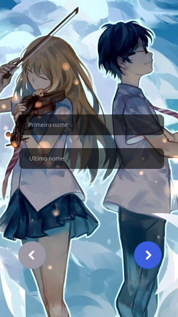
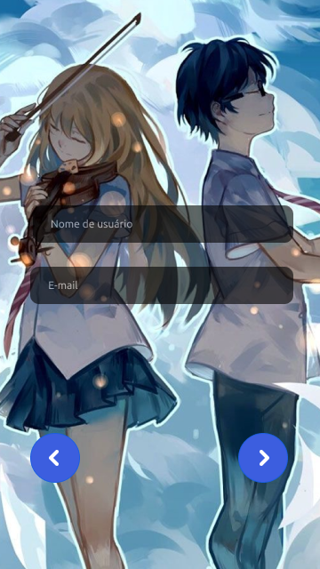
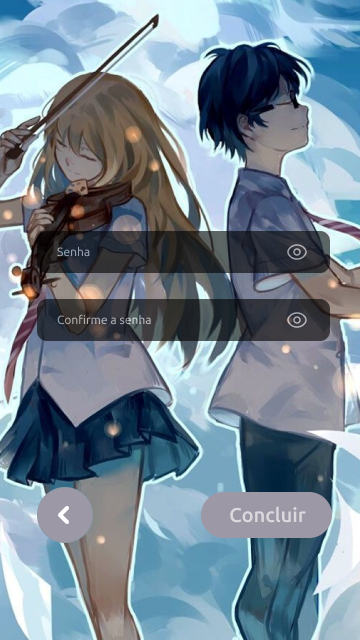
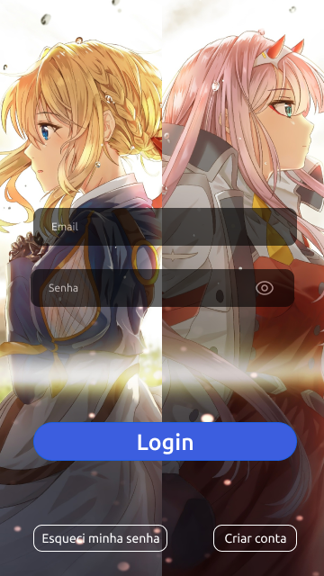
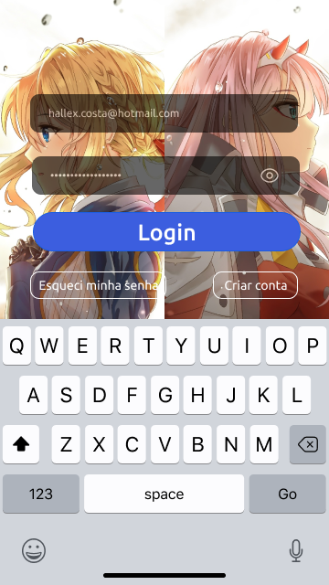
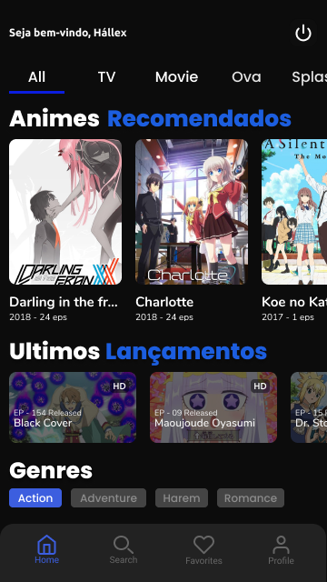
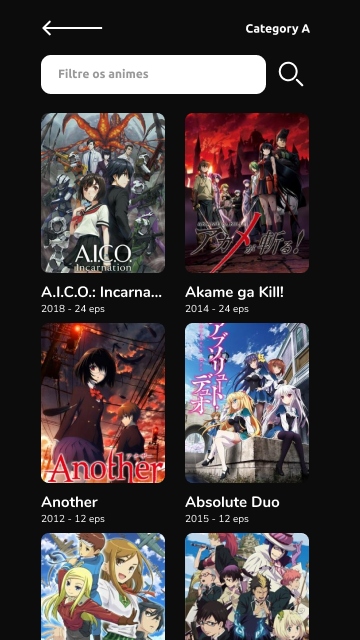
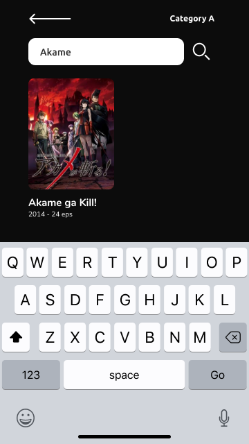
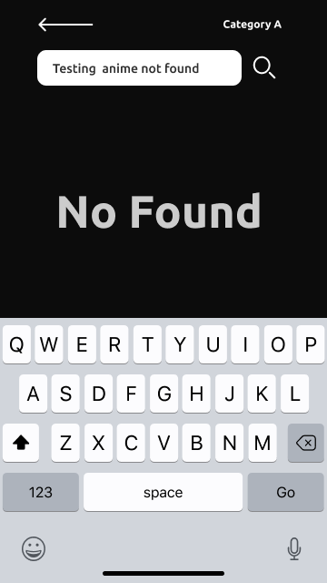

<h1 align="center">Animes United Platform</h1>

## Guide

- [Languages](#languages)
- [Tools](#tools)
- [Install](#install)
  - [Run](#run)
- [Screens](#screens)
  - [Splash](#splash)
  - [User Register](#user-register)
    - [User Register - Second](#user-register-second)
    - [User Register - Three](#user-register-three)
  - [User Login](#user-login)
    - [User Login - Onkeyboard](#user-login-onkeyboard)
    - [User Login - Filled Fields](#user-login-filled-fields)
  - [Home](#home)
  - [Category Animes](#category-animes)
  - [Category Animes - Filter By Name](#category-animes-filter-by-name)
    - [Category Animes - Filter By Name - No Found](#category-animes-filter-by-name-not-found)
  - [Anime Detail](#anime-detail)
    - [Anime Detail - Watched Episodes](#anime-detail-watched-episodes)

[](#languages)

## Languages

- [x] Typescript

[](#Tools)

## Tools

- [x] Standardization of Code
  - [x] ESLint
  - [x] Husky
  - [x] Lint Staged
  - [x] Commit Lint
  - [x] TSConfig Paths
  - [x] Yarn Workspaces
- [x] Libraries
  - [x] HTTP
    - [x] Axios
  - [x] Mobile
    - [x] React Native
- [x] Frameworks
  - [x] Tests Frameworks
    - [x] Jest
  - [x] Tests Libraries
    - [x] Supertest
  - [x] Server
    - [x] Express
  - [x] Mobile
- [x] API to Control
  - [x] Puppeteer
- [x] Database
  - [x] MongoDB
- [x] UI Design
  - [x] Figma

[](#install)

## Install

```sh
# Cloning project
$ git clone git@github.com:HallexCosta/animes-united.git

# Accessing directory of project
$ cd animes-united

# Install dependencies
$ yarn
```

### Run

[](#run)

```sh
# Run Server
$ yarn workspace @animes-united/server start:development
# --------------------
# Run Expo App
$ yarn workspace @animes-united/mobile run start
```

[](#screens)

## Screens

| #     | Screens                          | Added |
| ----- | -------------------------------- | ----- |
| **1** | Splash                           | ❌    |
| **2** | Register                         | ❌    |
| **3** | Login                            | ❌    |
| **4** | Home                             | ❌    |
| **5** | Categories Animes                | ✅    |
| **6** | Category Animes                  | ✅    |
| **7** | Category Animes - Filter By Name | ✅    |
| **8** | Anime Detail                     | ✅    |

[](#splash)

### Splash


---

[](#user-register)

### User Register



[](#user-register-second)

### User Register - Second



[](#user-register-three)

### User Register - Three



---

[](#user-login)

### User Login



[](#user-login-onkeyboard)

### User Login - Onkeyboard



[](#user-login-filled-fields)

### User Login - Filled Fields


---

[](#home)

### Home



---

[](#category-animes)

### Category Animes



---

[](#category-animes-filter-by-name)

### Category Animes - Filter By Name



[](#category-animes-filter-by-name-not-found)

### Category Animes - Filter By Name - No Found



---

[](#anime-detail)

### Anime Detail


[](#anime-detail-watched-episodes)

### Anime Detail - Watched Episodes


## Contributors

| Aluno                                                                                                                                |
| ------------------------------------------------------------------------------------------------------------------------------------ |
| [<br><sub>@HallexCosta</sub>](https://github.com/HallexCosta) |
